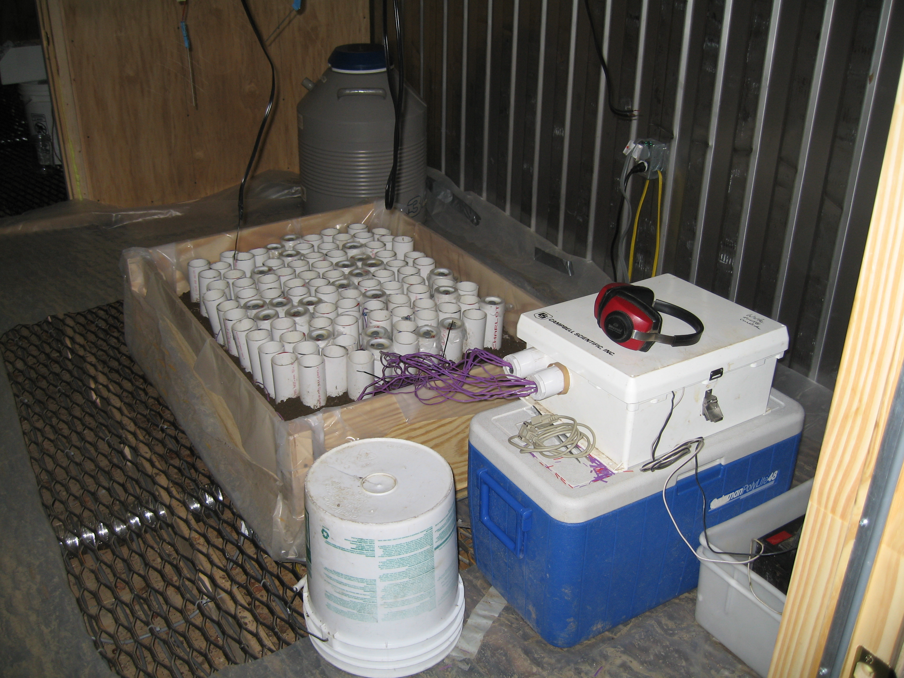
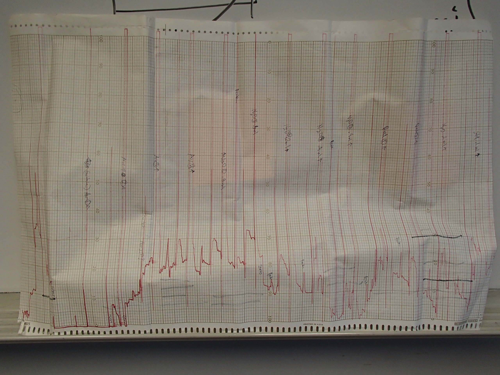
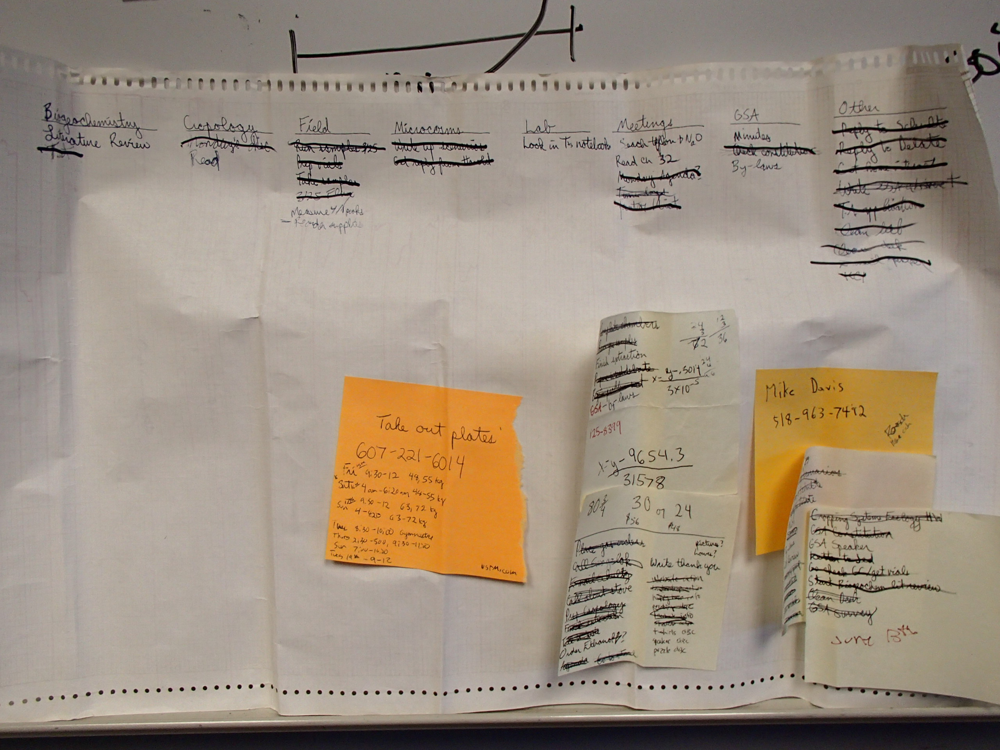

## Prompt
  
##### (Names have been changed to protect identities)  

Danae Rietzel set up an experiment to examine the effect of soil thawing temperature on nitrous oxide (N2O) emissions. She created a mesocosm inside a refrigerated shipping container to simulate soil freezing and thawing. She excavated 102 intact soil cores inside pvc and split the cores into five groups.  Group 1 was used to monitor experimental conditions, some cores had temperature sensors and the output was recorded by a datalogger. Group 2 was used to collect N2O every 12 hours for 196 hours. Groups 3-5 were used to determine how much N2 vs. N2O was coming from the soil during 30-48, 104-122, and 176-194 hours. All N2O collection from groups 2-5 resulted in small vials filled with gas from the headspace of the cores, ~3000 vials at the end of 196 hours. Danae was working alone, so she labeled these vials during collection using letters and numbers only she understood.  

Danae had the privilege to analyze the contents of the vials on the machine that discovered spring N2O peaks and I'm sure this honor made up for the fact that output was recorded on long scrolls of paper. The output was drawn in the form of a peak which was measured by a ruler and the length was written down on a piece of paper. This length was compared to the length of a known amount to determine how much N2O was in each vial. The data on the papers was typed into the Excel file that accompanies this homework.  

  

  

Danae used the data to make a poster and wrote up the mesocosm as a chapter in her thesis. She kept the scrolls of data around for a while, occassionally using them for scrap paper until she eventually threw them all away/ceremonially burned them. She kept the sheets with the written peak values and believes they are probably somewhere in her basement. Probably in that big box marked "peaches", in no folder, where she dumped all her Masters documents when she fled her office.   

Danae found some really interesting treatment differences during this experiment, but always seems to have another project that is a higher priority for publication. Fortunately, Danae has tried to change a lot in the eight years since this experience, but she now realizes the inevitable pain that will occur when she returns to these data and it may be one reason that prevents the N2O mesocosm from getting the "priority" ranking it deserves.  

From the details you have read in this narrative and the spreadsheet that goes along with it, what could past Danae have done differenly to help present Danae find the data more approachable?  

1) Identify three irreproducible practices.  
2) List three questions you would have for Danae if you had to use the spreadsheet for analysis.  
3) Refer to Broman's [points for spreadsheet organization](http://kbroman.org/dataorg/) and list 10 changes that need to happen to the spreadsheet to make it more useable.  

## Instructions:
Copy and save a **new copy** of this file, replacing "Lastname" and "Firstname" with your own and leaving the original unedited.

In **your copy**, replace the `title:` and `author:` fields in the YAML above, while leaving the remaining fields intact. Remove the Prompt and Instructions sections and complete your homework!
